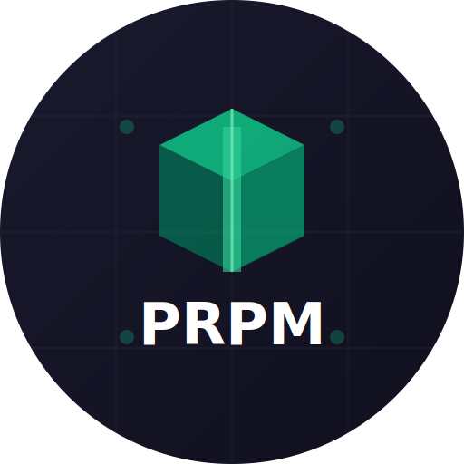

<p align="center">
  
</p>

# PRPM - The Package Manager for AI Prompts

The universal registry for AI coding tools.

Discover and install cross-platform prompts, rules, skills, and agents that work with Cursor, Claude, Continue, Windsurf, GitHub Copilot, OpenAI Codex, Google Gemini, Kiro, and more — all from one file.

```bash
npm install -g prpm
prpm install collections/nextjs-pro  # Entire Next.js setup in one command
```
Installs 20 packages: backend-architect, cloud-architect, database-architect, and more

7,5000+ cross platform packages

[Docs](https://docs.prpm.dev) | [Search Packages](https://prpm.dev/search) | [Search Collections](https://prpm.dev/search?tab=collections)

---


## Self Improve
Give your IDE the ability to self improve by installing packages that it finds useful:


---

## Universal Packages - Install Once, Use Anywhere

Every package works in **any** AI editor. No conversion tools, no separate downloads:

```bash
# Same package, different editors
prpm install @sanjeed5/react --as cursor                    # → .cursor/rules/
prpm install @sanjeed5/react --as claude --subtype agent    # → .claude/agents/
prpm install @sanjeed5/react --as continue                  # → .continue/prompts/
prpm install @sanjeed5/react --as windsurf                  # → .windsurf/rules/
prpm install @sanjeed5/react --as copilot                   # → .github/instructions/
prpm install @sanjeed5/react --as kiro                      # → .kiro/steering/
```

## Discovery - Find What You Need

Browse packages with powerful discovery:

```bash
# Search by keyword
prpm search react
prpm search "test driven development"

# See what's trending
prpm trending

# Get detailed info
prpm info @username/react-best-practices
# → Shows: description, downloads, rating, tags, installation instructions

# Browse collections
prpm collections
prpm collections search frontend
prpm collections info collection/nextjs-pro
```

[CLI Reference](https://docs.prpm.dev/cli/overview)

---

## Playground

Test packages interactively before installing:

```bash
# Try a package in the browser playground
prpm playground --package @username/react-best-practices

# Test with different AI models
# → Opens browser playground at prpm.dev/playground
# → Select model: Claude 3.5 Sonnet, GPT-4, etc.
# → Test prompt with sample code
# → See results before installing
```

**Features:**
-  **Multi-Model Testing** - Try packages with Claude, GPT-4, and more
-  **Free Credits** - 1,000 monthly credits for all logged in users
-  **Live Results** - See how prompts perform in real-time
-  **Save Sessions** - Resume testing later
-  **Compare Models** - Test same prompt across different AI models

**[Try Playground →](https://prpm.dev/playground)**

## Why PRPM?

### The Problem
```bash
# Current workflow (painful)
1. Find cursor rule on GitHub
2. Copy raw file URL
3. Create .cursor/rules/something.md
4. Paste content
5. Repeat for every rule
6. Update manually when rules change
7. Do it all again for Claude/Continue/Windsurf
```

### Team Consistency

If you're working on a big project and some coworkers use Copilot, others use Claude, and sometimes it's Cursor, the only way to unify rules so it's consistent across the codebase is to use PRPM. It's an easy way to make sure everyone has the same rules across the team.

## For Package Authors

### Share Your Packages

Package authors can publish to PRPM and reach users across all editors.

**How it works:**
- Authors publish in canonical format
- PRPM converts to all editor formats automatically
- Users install in their preferred editor

**Benefits:**
- At least 4x reach (Cursor + Claude + Continue + Windsurf users, + more)
- One package, works everywhere
- Version control and updates
- Download analytics

---

## Stats

- **7,500+ packages** - Cursor rules, Claude skills/agents, Windsurf rules, MCP configs
- **Universal package manager** - Works with Cursor, Claude, Continue, Windsurf and more
- **100+ Collections** - Complete workflow setups in one command
- **6+ editor formats** supported (server-side conversion)


## Contributing

We welcome contributions!

-  **Add packages** - Submit your prompts (they'll work in all editors!)
-  **Create collections** - Curate helpful package bundles
-  **Report bugs** - Open issues
-  **Suggest features** - Start discussions
-  **Write tests** - Improve coverage

**[Contributing Guide →](CONTRIBUTING.md)**

---

## License

MIT License - See [LICENSE](LICENSE)
