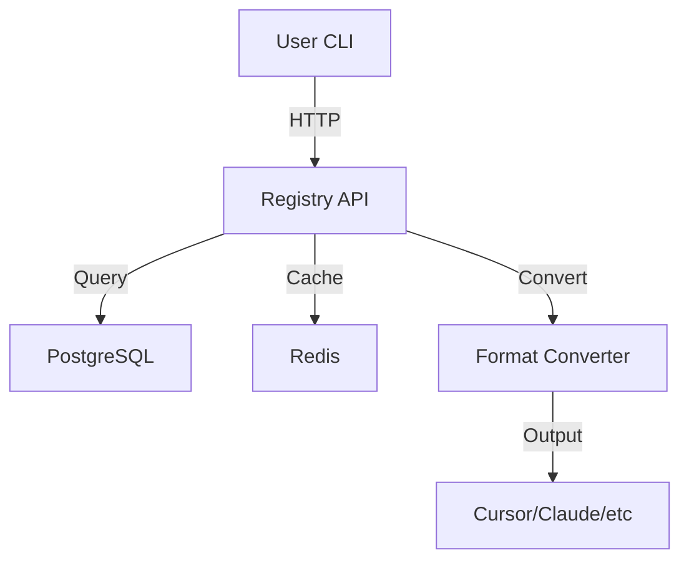
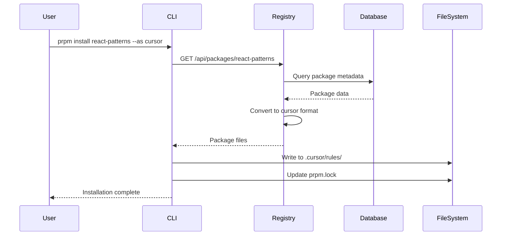
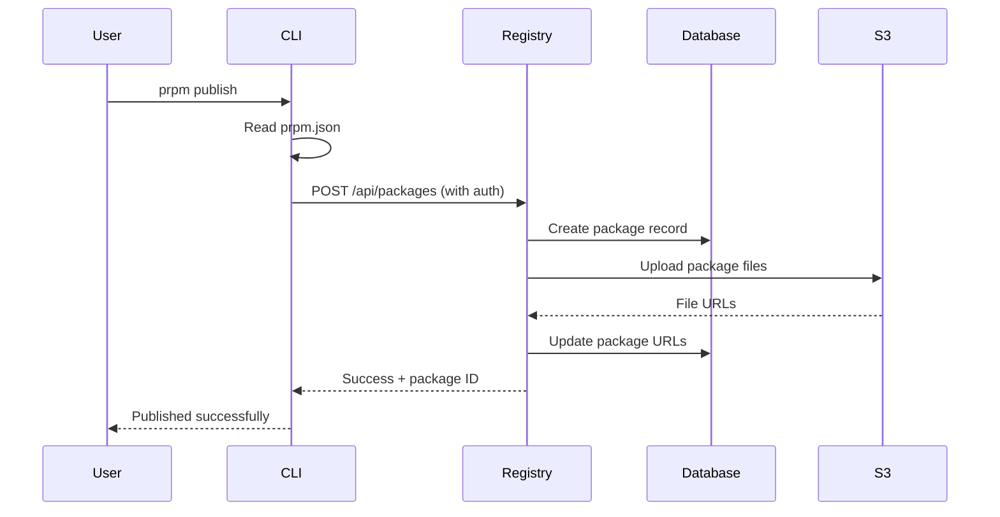

## System Overview

PRPM is a distributed system consisting of a CLI client, registry API, and database layer with built-in format conversion capabilities.



## Core Components

### CLI Client

The command-line interface is the primary way users interact with PRPM.

<Card title="Technology Stack" icon="code">
- **Runtime**: Node.js + TypeScript
- **CLI Framework**: Commander.js
- **HTTP Client**: Axios
- **File System**: Native Node.js fs/promises
</Card>

**Key Responsibilities**:
- Package installation and management
- Configuration management (`~/.prpmrc`, `.prpmrc`, `prpm.lock`)
- Authentication and authorization
- Local file system operations
- Format detection and conversion requests

**File Locations**:
- `~/.prpmrc` - Global user config with auth tokens
- `.prpmrc` - Repository-level config
- `prpm.lock` - Project lockfile
- `.cursor/rules/` - Cursor packages
- `.claude/skills/` - Claude skills
- `.claude/agents/` - Claude agents

### Registry API

The registry is a REST API that manages packages, authentication, and serves package data.

<Card title="Technology Stack" icon="server">
- **Framework**: Fastify (Node.js)
- **Database**: PostgreSQL with Drizzle ORM
- **Cache**: Redis
- **Storage**: AWS S3 (for package files)
- **Authentication**: JWT tokens
</Card>

**Key Responsibilities**:
- Package publishing and versioning
- User authentication and authorization
- Search and discovery
- Download and conversion endpoints
- Quality scoring and metadata

**Endpoints**:
```
POST   /api/auth/login
POST   /api/auth/register
GET    /api/packages
POST   /api/packages
GET    /api/packages/:id
GET    /api/packages/:id/download
POST   /api/collections
GET    /api/collections/:id
```

### Database Layer

PostgreSQL stores all persistent data with Redis for caching.

<Tabs>
  <Tab title="PostgreSQL Schema">
    **Tables**:
    - `users` - User accounts and authentication
    - `packages` - Package metadata and versions
    - `collections` - Package collections
    - `downloads` - Download statistics
    - `package_tags` - Package categorization
    - `verified_authors` - Verified publisher list
  </Tab>
  <Tab title="Redis Cache">
    **Cache Keys**:
    - `package:{id}` - Package metadata (TTL: 5 min)
    - `search:{query}` - Search results (TTL: 1 min)
    - `user:{id}` - User data (TTL: 15 min)
    - `collection:{id}` - Collection data (TTL: 5 min)
  </Tab>
</Tabs>

### Format Conversion System

The conversion system transforms packages between different AI tool formats.

<Card title="Conversion Flow" icon="arrows-rotate">
1. Package stored in canonical format
2. Client requests specific format (`--as cursor`)
3. Server converts on-demand
4. Quality score calculated for lossy conversions
5. Converted package cached for performance
</Card>

**Supported Formats**:
- **Cursor** - MDC rules with frontmatter
- **Claude** - Skills and agents with YAML
- **Continue** - JSON configuration
- **Windsurf** - Plain markdown rules
- **GitHub Copilot** - Instructions files
- **Generic** - Universal format

**Quality Scoring**:
- Lossless conversions: 100%
- Minimal loss: 90-99%
- Moderate loss: 70-89%
- Significant loss: <70%

## Data Flow

### Package Installation



### Package Publishing



## Configuration System

PRPM uses a layered configuration approach with clear precedence.

<Steps>
  <Step title="Default Values">
    Built-in defaults provide sensible starting points
  </Step>
  <Step title="User Config (~/.prpmrc)">
    Global preferences and authentication
  </Step>
  <Step title="Repository Config (.prpmrc)">
    Project-specific settings
  </Step>
  <Step title="Environment Variables">
    Runtime overrides (PRPM_REGISTRY_URL)
  </Step>
  <Step title="Command-Line Flags">
    Explicit per-command overrides
  </Step>
</Steps>

**Merge Strategy**: Later layers override earlier ones, with deep merging for nested objects.

## Security Model

### Authentication

<Card title="JWT Token-Based Auth" icon="lock">
- User logs in with `prpm login`
- Server issues JWT token
- Token stored in `~/.prpmrc`
- Token sent in `Authorization` header
- Tokens expire after 30 days
</Card>

### Authorization

**Permission Levels**:
- **Anonymous** - Read public packages
- **Authenticated** - Publish packages, manage own content
- **Verified** - Verified badge on packages
- **Admin** - Full registry management

### Package Security

<Check>
**Security Measures**
- SHA-256 checksums in lockfiles
- HTTPS-only downloads
- Package signing (planned)
- Malware scanning (planned)
</Check>

## Performance Optimizations

### Caching Strategy

<Tabs>
  <Tab title="Redis Cache">
    - Package metadata: 5 minutes
    - Search results: 1 minute
    - User data: 15 minutes
    - Collection data: 5 minutes
  </Tab>
  <Tab title="CDN (Planned)">
    - Static package files
    - Geographic distribution
    - Cache invalidation on publish
  </Tab>
</Tabs>

### Database Optimization

- **Indexes**: Full-text search on package names/descriptions
- **Materialized Views**: Popular packages, trending searches
- **Connection Pooling**: Reuse database connections
- **Query Optimization**: Selective field loading, pagination

## Scalability

### Horizontal Scaling

The registry API is stateless and can scale horizontally:

```
Load Balancer
    ↓
[API 1] [API 2] [API 3]
    ↓       ↓       ↓
PostgreSQL + Redis (Shared)
```

### Vertical Scaling

- **Database**: Read replicas for query load
- **Redis**: Redis Cluster for cache distribution
- **Storage**: S3 handles unlimited package storage

## Technology Choices

### Why Fastify?

<Card title="Fastify Benefits" icon="bolt">
- **Fast**: One of the fastest Node.js frameworks
- **TypeScript Support**: First-class TypeScript support
- **Schema Validation**: Built-in JSON schema validation
- **Plugin System**: Modular architecture
</Card>

### Why PostgreSQL?

<Card title="PostgreSQL Benefits" icon="database">
- **Reliability**: ACID compliance, data integrity
- **Full-Text Search**: Native search capabilities
- **JSON Support**: Store flexible package metadata
- **Scalability**: Proven at scale
</Card>

### Why Redis?

<Card title="Redis Benefits" icon="bolt">
- **Speed**: In-memory performance
- **TTL Support**: Automatic cache expiration
- **Data Structures**: Rich data types
- **Pub/Sub**: Real-time notifications (future)
</Card>

## Deployment Architecture

<CodeGroup>

```yaml AWS (Current)
# Elastic Beanstalk deployment
- EC2 instances running Node.js
- RDS PostgreSQL (managed)
- ElastiCache Redis (managed)
- S3 for package storage
- CloudFront CDN (planned)
- Route 53 for DNS
```

```yaml Self-Hosted (Alternative)
# Docker Compose deployment
- Node.js container (API)
- PostgreSQL container
- Redis container
- MinIO for S3-compatible storage
- Nginx reverse proxy
```

</CodeGroup>

## Future Architecture

### Planned Enhancements

<CardGroup cols={2}>
  <Card title="Package Signing" icon="signature">
    Cryptographic signatures for package verification
  </Card>
  <Card title="CDN Integration" icon="globe">
    Global edge caching for faster downloads
  </Card>
  <Card title="Analytics Pipeline" icon="chart-line">
    Real-time usage analytics and insights
  </Card>
  <Card title="Webhook System" icon="webhook">
    Event notifications for package updates
  </Card>
</CardGroup>

## See Also

<CardGroup cols={2}>
  <Card title="Format Conversion" icon="arrows-rotate" href="/guides/format-conversion">
    How format conversion works
  </Card>
  <Card title="Configuration" icon="gear" href="/concepts/configuration">
    Configuration system details
  </Card>
  <Card title="Publishing" icon="upload" href="/publishing/getting-started">
    Publishing packages
  </Card>
  <Card title="CLI Reference" icon="terminal" href="/cli/commands">
    Complete CLI documentation
  </Card>
</CardGroup>
